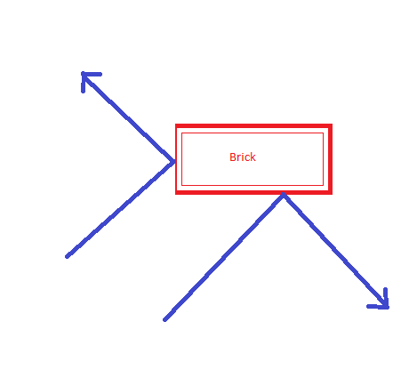
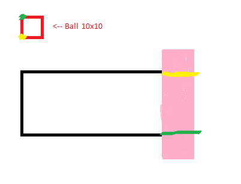

# CSE3130-Project-BrickBreaker

#### What is the program?

This is a simple remake of the popular game Atari-Breakout / Brick - Breaker. This is fully made in python using pygame. Upon launching the program, you will be greeted by a starting screen in which you have to press SPACE to start. For each block broken, your score will increase. The goal is to not let the ball touch the ground, as it will deduct one life. As soon as your life count (starting at 3) reaches 0, the game ends. This game does not have a "win" scenario, instead it has endless levels in which you can try your best to survive in! If you ever need to exit the game, just hit the red X button on the corner of the floating window!

#### Insight on planning behind the game!

The main component of planning behind this game was the collisions. A collision is viewed as the change in direction, however, these change in directions can be either in the X-axis or the Y-axis. If the ball bounces on the side of the brick, the ball will change its horizontal direction. If the ball bounces on the top/bottom of a block, then the ball will respond by changing the vertical direction! 

Image to describe:

In order to combat this problem, it is crucial to understand on what edge did the ball bounce on. In this program, we compared certain X and Y coordinates of the ball with the bricks to figure out which side they got hit on!

Refer to this picture for the brief explaination:

For the side collisions (right side collision in the image), I would test to see if the ball was completely in the pink shaded area. How? First I would test to see if the ball and the block had collided anywhere. Notice the top left and bottom left corners of the ball have specific colors. In order to confirm the ball was in the shaded area, I would check if the **green** point was _above_ **the green line** and if the **yellow point** was _below_ the **yellow line**. Furthermore, we would make sure both of these points were touching the blocks right edge. If these conditions were met, I could be sure that the ball has touched the right edge of the block.

#### Special Features

In comparision to the regular brick breaker, my variant adds some special things to improve the gameplay. 

1) Never ending game play

In my variant of the game, the player is not limited by the game's lack of levels, instead they are only limited by their own skill. There are unlimited levels (of which only up to level 3 has been tested as I can't get further)! This means the levels aren't hard coded into the gameplay, instead they are placed into a loop to make every level different.
    
2) Lives

For players like me, who aren't great at this game, having multiple lives is a great feature. This allows for slight errors when playing and not having to start over.
    
#### How to run program!

##### Pre-requisites

 - You MUST have python installed onto your machine
    - If you, don't have python, install it from "https://www.python.org/downloads/"
 
 1) Installing pygame
 
 Check if you already have the pygame module by openning up Command Prompt and typing `pip show pygame`. If it prints out the information, you are good to go. If it does not give information on the module, install it by typing `pip install pygame`.
 
 2) Running program
 
 Open the folder with the files inside (where the files are stores from your download from Git). 
 
 Now in the file explorer, in the navigation bar, type in `CMD` like shown below:
 
 
 
 Hit enter and command prompt should launch from that folder.
 
 Now simply type `python main.py`
 
 Brick - Breaker should be running!